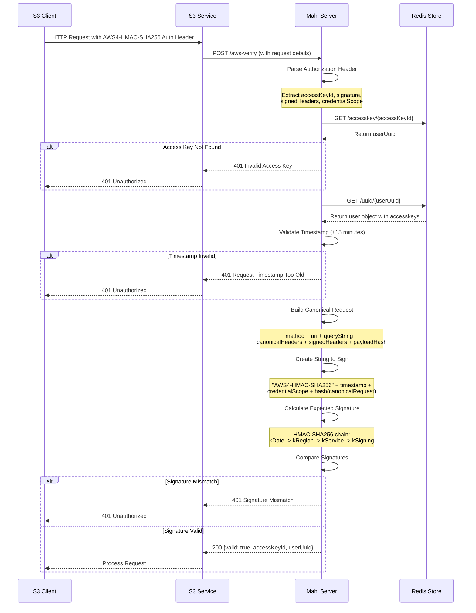

<!--
    This Source Code Form is subject to the terms of the Mozilla Public
    License, v. 2.0. If a copy of the MPL was not distributed with this
    file, You can obtain one at http://mozilla.org/MPL/2.0/.
-->

<!--
    Copyright 2019 Joyent, Inc.
    Copyright 2025 Edgecast Cloud LLC.
-->

# mahi

This repository is part of the Triton Data Center and Manta projects.
For contribution guidelines, issues, and general documentation, visit the main
[Triton](http://github.com/TritonDataCenter/triton) and
[Manta](http://github.com/TritonDataCenter/manta) project pages.

Mahi is the authentication cache. It has two components: the replicator and the
server. The replicator pulls in account, user, role, group, and
key information from UFDS and caches them in a local redis instance.
The server is a restify server that talks to the redis instance.


## Active Branches

There are currently two active branches of this repository, for the two
active major versions of Manta. See the [mantav2 overview
document](https://github.com/TritonDataCenter/manta/blob/master/docs/mantav2.md) for
details on major Manta versions.

- [`master`](../../tree/master/) - For development of mantav2, the latest
  version of Manta. This is the version used by Triton.
- [`mantav1`](../../tree/mantav1/) - For development of mantav1, the long
  term support maintenance version of Manta.


## Interface

    GET /accounts/:accountid
    GET /accounts?login=:accountlogin
    GET /users/:userid
    GET /users?account=x&login=y&fallback=true
    GET /uuids?account=x&type=y&name=z1&name=z2
    GET /names?uuid=x1&uuid=x2
    GET /aws-auth/:accesskeyid
    POST /aws-verify


## Redis Schema

All data is stored in keys of the form `/uuid/<uuid>`. There are also mappings
for login or name to uuid, and sets that contain full lists of uuids.

    /uuid/<accountUUID> ->
    {
        type: "account",
        uuid: <uuid>,
        keys: {keyfp: key},
        groups: [str],
        login: <login>,
        approved_for_provisioning: bool
    }

    /uuid/<userUUID> ->
    {
        type: "user",
        uuid: <uuid>,
        account: <parentAccountUUID>,
        keys: {keyfp: key},
        accesskeys: {accessKeyId: secret},
        roles: [roleUUID],
        defaultRoles: [roleUUID],
        login: <login>,
    }

    /uuid/<policyUUID> ->
    {
        type: "policy",
        uuid: <uuid>,
        name: <name>,
        rules: [ [text, parsed], ..., [text, parsed] ],
        account: <parentAccountUUID>
    }

    /uuid/<roleUUID> ->
    {
        type: "role",
        uuid: <uuid>,
        name: <name>,
        account: <parentAccountUUID>,
        policies: [policyUUID]
    }

    /account/<accountLogin> -> accountUUID
    /user/<accountUUID>/<userLogin> -> userUUID
    /role/<accountUUID>/<roleName> -> roleUUID
    /policy/<accountUUID>/<policyName> -> policyUUID
    /accesskey/<accessKeyId> -> userUUID

    /set/accounts -> set of accountUUIDs
    /set/users/<account> -> set of userUUIDs
    /set/roles/<account> -> set of roleUUIDSs
    /set/policies/<account> -> set of policyUUIDs

## AWS Signature V4 Authentication

Mahi supports AWS Signature Version 4 (SigV4) authentication for S3 API compatibility.

### SigV4 Authentication Flow



### SigV4 Authentication Process

The SigV4 authentication process in Mahi follows the AWS Signature Version 4 specification:

1. **Authorization Header Parsing** (`lib/server/sigv4.js:27-58`):
   - Extracts `accessKeyId`, `signature`, `signedHeaders`, and credential scope from the `AWS4-HMAC-SHA256` header
   - Validates the header format and structure

2. **Access Key Lookup** (`lib/server/sigv4.js:160-172`):
   - Uses Redis reverse lookup `/accesskey/{accessKeyId}` to find the user UUID
   - Retrieves the full user object from `/uuid/{userUuid}` containing access key secrets

3. **Timestamp Validation** (`lib/server/sigv4.js:205-212`):
   - Validates the `x-amz-date` or `date` header is within ±15 minutes of current time
   - Prevents replay attacks with old signatures

4. **Canonical Request Creation** (`lib/server/sigv4.js:63-98`):
   - Builds a canonical representation of the HTTP request
   - Includes HTTP method, URI, query string, canonical headers, signed headers, and payload hash
   - Follows AWS SigV4 specification for string formatting

5. **String to Sign Creation** (`lib/server/sigv4.js:103-111`):
   - Creates the string that will be signed using the canonical request
   - Format: `"AWS4-HMAC-SHA256\n" + timestamp + "\n" + credentialScope + "\n" + hash(canonicalRequest)`

6. **Signature Calculation** (`lib/server/sigv4.js:116-127`):
   - Implements the AWS SigV4 signing process using HMAC-SHA256
   - Creates a signing key through a chain of HMAC operations: `kDate -> kRegion -> kService -> kSigning`
   - Calculates the expected signature using the signing key and string to sign

7. **Signature Verification** (`lib/server/sigv4.js:250-260`):
   - Compares the calculated signature with the signature from the authorization header
   - Returns authentication result with user information if signatures match

### New Endpoints

#### GET /aws-auth/:accesskeyid

Returns user information for the given AWS access key ID. 

Response:
```json
{
    "type": "account",
    "uuid": "user-uuid",
    "login": "username",
    "accesskeys": ["AKIA123456789EXAMPLE"],
    "approved_for_provisioning": true
}
```

#### POST /aws-verify

Verifies an AWS Signature Version 4 request signature. This endpoint is designed to be called by S3-compatible services that need to validate AWS SigV4 authentication.

**Implementation Details** (`lib/server/server.js:303-324`):
- Accepts the original HTTP request details as query parameters (`method`, `url`)
- Validates the `Authorization` header containing the AWS4-HMAC-SHA256 signature
- Performs comprehensive signature verification including timestamp validation
- Returns authentication result with user information

**Request Format**:
```bash
POST /aws-verify?method=GET&url=/bucket/object
Authorization: AWS4-HMAC-SHA256 Credential=AKIA123456789EXAMPLE/20230101/us-east-1/s3/aws4_request, SignedHeaders=host;x-amz-date, Signature=...
x-amz-date: 20230101T120000Z
x-amz-content-sha256: UNSIGNED-PAYLOAD
```

**Response**:
```json
{
    "valid": true,
    "accessKeyId": "AKIA123456789EXAMPLE", 
    "userUuid": "user-uuid"
}
```

**Error Responses**:
- `401 Invalid Signature` - Missing or malformed authorization header
- `401 Invalid Access Key` - Access key not found in Redis
- `401 Request Timestamp Too Old` - Timestamp outside ±15 minute window
- `401 Signature Mismatch` - Calculated signature doesn't match provided signature

## Testing

Auth data from tests/data is loaded into a fake redis implemented in node for
testing.
Run `make test`.


#### AWS SigV4 Endpoints

**Testing Access Key Lookup:**
```bash
# Get user information by access key ID
curl -i http://localhost:8080/aws-auth/AKIA123456789EXAMPLE

# Expected response:
# {
#   "type": "account", 
#   "uuid": "550e8400-e29b-41d4-a716-446655440001",
#   "login": "s3user",
#   "accesskeys": ["AKIA123456789EXAMPLE", "AKIA987654321EXAMPLE"],
#   "approved_for_provisioning": true
# }

# Test nonexistent access key
curl -i http://localhost:8080/aws-auth/AKIANONEXISTENT0001
# Expected: 404 ObjectDoesNotExist error
```

### Redis Data Inspection

**Check Access Key Storage:**
```bash
# Connect to Redis
redis-cli

# Check user record with access keys
redis> GET /uuid/550e8400-e29b-41d4-a716-446655440001
# Shows: {"accesskeys": {"AKIA123456789EXAMPLE": "secret..."}}

# Check reverse lookup mapping
redis> GET /accesskey/AKIA123456789EXAMPLE  
# Shows: 550e8400-e29b-41d4-a716-446655440001

```
