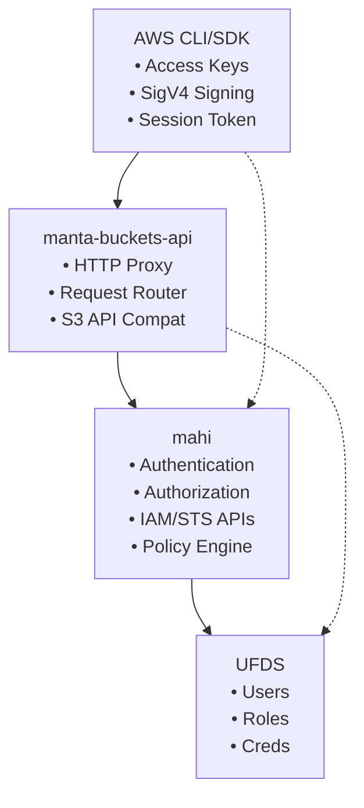
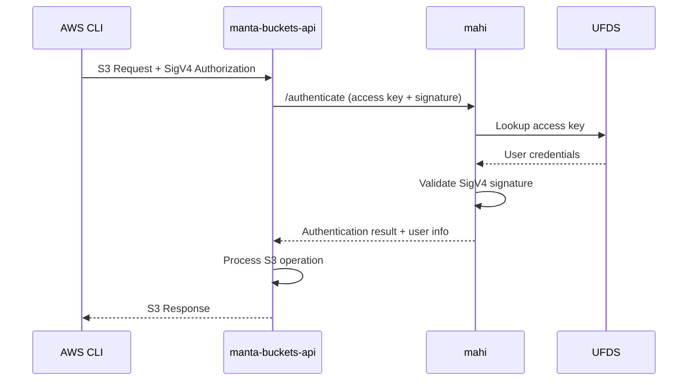
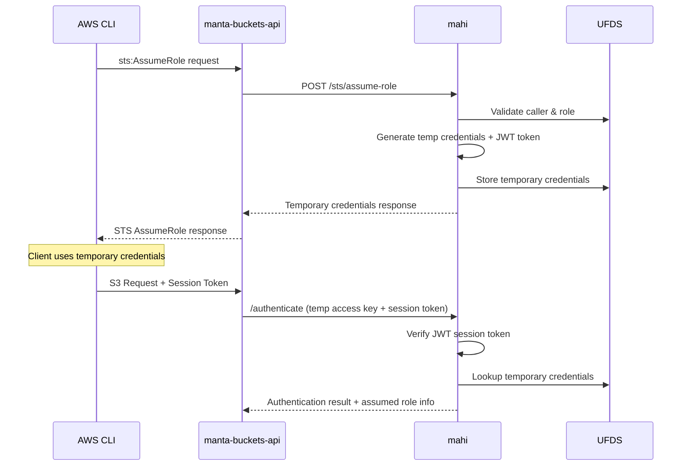
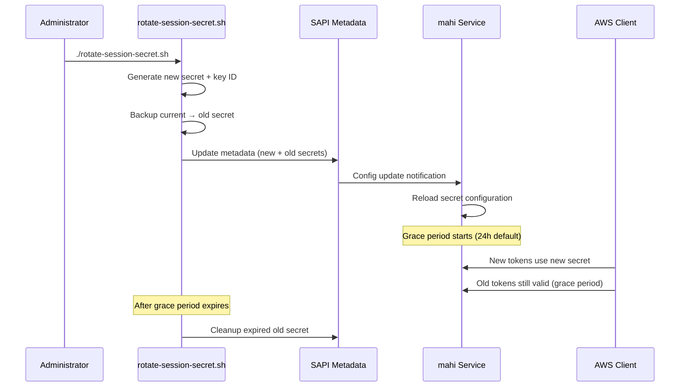

# Mahi Architecture for Manta S3 Compatibility

This document describes the architecture and implementation of mahi's role in providing AWS-compatible authentication and authorization for the Manta S3 compatibility layer.

## Overview

Mahi serves as the centralized authentication and authorization service for Manta's S3 compatibility layer, implementing AWS Identity and Access Management (IAM) and Security Token Service (STS) functionality. It provides:

- **User Authentication**: Validates Triton access keys and signatures
- **IAM Role Management**: Creates and manages AWS-compatible roles
- **STS Operations**: Issues temporary credentials via AssumeRole
- **Policy Evaluation**: Enforces IAM policies for resource access
- **Session Token Security**: Provides cryptographically secure JWT session tokens

## System Architecture



## Authentication Flow

### Standard Triton Access Key Authentication



### STS AssumeRole Authentication



## Credential Formats

### Triton Access Key Format (TRITON-2513)

**Access Key ID**: 32-character hexadecimal string
```
Example: 318358491dd54e8740f76ffac7c5bdc9
Format:  [a-f0-9]{32}
```

**Secret Access Key**: `tdc_` prefix + base64-encoded bytes
```
Example: tdc_S8YMXSmJMK6CkS0wR9QKc8j2pXvY1mN4
Format:  tdc_[A-Za-z0-9+/]{40}
```

**Generation Process**:
```javascript
// Access Key ID - 32 hex characters (16 random bytes)
var accessKeyId = crypto.randomBytes(16).toString('hex');

// Secret Key - UFDS accesskey module with tdc_ prefix
accesskey.generate(accesskey.DEFAULT_PREFIX, accesskey.DEFAULT_BYTE_LENGTH, 
    function(err, secretKey) {
        // secretKey = "tdc_" + base64_encoded_32_random_bytes
    });
```

## Core Components

### Authentication Engine (`/authenticate` endpoint)

**Purpose**: Validates Triton access keys and signatures for incoming requests

**Key Features**:
- SigV4 signature validation using `sigv4.js`
- Support for both permanent and temporary credentials
- JWT session token verification for assumed role sessions
- Principal resolution (user/role identification)

**Request Flow**:
```javascript
POST /authenticate
{
    "accesskeyid": "318358491dd54e8740f76ffac7c5bdc9",
    "signature": "AWS4-HMAC-SHA256...",
    "stringtosign": "...",
    "sessiontoken": "eyJ..." // Optional for assumed roles
}
```

**Response**:
```javascript
{
    "account": { "uuid": "...", "login": "..." },
    "user": { "uuid": "...", "login": "..." },
    "assumedrole": "arn:aws:iam::123456:role/MyRole", // If applicable
    "roles": ["role1", "role2"]
}
```

### IAM Role Management

**Endpoints**:
- `POST /iam/create-role` - Create IAM roles
- `GET /iam/get-role` - Retrieve role information
- `DELETE /iam/delete-role` - Remove roles
- `POST /iam/list-roles` - List account roles

**Role Structure**:
```javascript
{
    "roleName": "MyRole",
    "roleArn": "arn:aws:iam::123456789012:role/MyRole", 
    "assumeRolePolicyDocument": "{...}",
    "description": "Role description",
    "maxSessionDuration": 3600
}
```

**UFDS Storage**:
- Roles stored as LDAP groups under `ou=roles,uuid=<account>,ou=users,o=smartdc`
- Role ARN stored in `objectclass` attribute
- Trust policy stored in custom attributes

### STS AssumeRole Service

**Endpoint**: `POST /sts/assume-role`

**Functionality**:
- Validates trust relationships between caller and role
- Generates temporary Triton access keys (TRITON-2513 format)
- Issues cryptographically secure JWT session tokens
- Stores temporary credentials in UFDS with expiration

**Temporary Credential Format**:
```javascript
{
    "accessKeyId": "a1b2c3d4e5f67890abcdef1234567890",    // 32 hex chars
    "secretAccessKey": "tdc_R9QKc8j2pXvY1mN4S8YMXSmJMK6C", // tdc_ prefix
    "sessionToken": "eyJhbGciOiJIUzI1NiIsInR5cCI6...",     // JWT token
    "expiration": "2025-11-19T14:30:00.000Z"
}
```

**Session Token Security**:
```javascript
// JWT v1.1 Payload Structure (with rotation support)
{
    "uuid": "caller-uuid",
    "roleArn": "arn:aws:iam::123456:role/MyRole",
    "sessionName": "session-name",
    "tokenType": "sts-session", 
    "tokenVersion": "1.1",
    "keyId": "key-20251122-a1b2c3d4",  // Key identification for rotation
    "iss": "manta-mahi",
    "aud": "manta-s3",
    "iat": 1640995200,
    "exp": 1640998800,
    "nbf": 1640995200
}
```

**Security Features**:
- HMAC-SHA256 signatures prevent tampering
- Time-based validation (iat, exp, nbf)
- Issuer/audience verification
- Payload-based key identification for secure rotation
- Multi-secret verification with configurable grace periods
- Automatic key expiration and cleanup
- Zero-downtime secret rotation capability

### SigV4 Signature Validation (`sigv4.js`)

**Purpose**: Implements AWS Signature Version 4 validation

**Key Features**:
- Canonical request reconstruction
- String-to-sign generation and validation
- Support for both query and header-based signatures
- Proper handling of Triton credential scoping

**Validation Process**:
1. Parse authorization header or query parameters
2. Reconstruct canonical request from HTTP request
3. Generate expected string-to-sign
4. Compare provided signature with computed signature using Triton secret key
5. Validate credential scope (region/service/date)

**Triton Credential Scope**:
```
<access-key-id>/<date>/<region>/<service>/triton_request
Example: 318358491dd54e8740f76ffac7c5bdc9/20251119/us-west-1/s3/triton_request
```

### Policy Evaluation Engine

**Integration Points**:
- Resource access validation in `manta-buckets-api`
- Action mapping from Manta operations to IAM actions
- Resource ARN construction for policy evaluation

**Action Mapping**:
```javascript
{
    'getdirectory': 's3:ListAllMyBuckets',
    'getbucket': 's3:ListBucket', 
    'putbucket': 's3:CreateBucket',
    'deletebucket': 's3:DeleteBucket',
    'getobject': 's3:GetObject',
    'putobject': 's3:PutObject',
    'deleteobject': 's3:DeleteObject'
}
```

## Integration with manta-buckets-api

### Request Processing Pipeline

1. **Request Ingestion**: `manta-buckets-api` receives AWS S3 API calls
2. **Authentication Forwarding**: Extracts auth info and forwards to mahi
3. **Response Processing**: Receives principal info and proceeds with operation
4. **Policy Enforcement**: Uses resolved principal for resource access decisions

### Session Token Handling

**manta-buckets-api Role**:
- Detects presence of `x-amz-security-token` header
- Forwards session token to mahi without processing
- Does not perform JWT verification (security separation)

**mahi Role**:
- Verifies JWT signature and claims
- Validates session token authenticity  
- Resolves to underlying assumed role and caller identity

### Communication Protocol

```javascript
// Authentication Request from buckets-api to mahi
POST /authenticate
Headers: {
    "content-type": "application/json"
}
Body: {
    "accesskeyid": "318358491dd54e8740f76ffac7c5bdc9",
    "signature": "calculated-signature",
    "stringtosign": "canonical-string-to-sign",
    "sessiontoken": "jwt-token-if-present"
}

// Authentication Response from mahi to buckets-api  
{
    "account": {
        "uuid": "account-uuid",
        "login": "account-login"
    },
    "user": {
        "uuid": "user-uuid", 
        "login": "user-login"
    },
    "assumedrole": "arn:aws:iam::123456:role/AssumedRole",
    "roles": ["operator", "readonly"]
}
```

## Configuration

### Session Token Configuration

```json
{
    "sessionConfig": {
        "secretKey": "{{SESSION_SECRET_KEY}}",
        "secretKeyId": "{{SESSION_SECRET_KEY_ID}}",
        "oldSecretKey": "{{SESSION_SECRET_KEY_OLD}}",
        "oldSecretKeyId": "{{SESSION_SECRET_KEY_OLD_ID}}",
        "rotationTime": "{{SESSION_SECRET_ROTATION_TIME}}",
        "gracePeriod": "{{SESSION_SECRET_GRACE_PERIOD}}",
        "issuer": "manta-mahi",
        "audience": "manta-s3", 
        "defaultDuration": 3600,
        "maxDuration": 43200
    }
}
```

### UFDS Configuration

```json
{
    "ufds": {
        "url": "ldaps://ufds.domain.com",
        "bindDN": "cn=root",
        "bindCredentials": "secret",
        "maxConnections": 2,
        "timeout": 5000
    }
}
```

## JWT Session Token Rotation

### Rotation Architecture

**Design Principles**:
- **Zero-downtime rotation**: No service interruption during secret changes
- **Graceful transitions**: Old and new secrets coexist during grace periods
- **Payload-based identification**: Key IDs in JWT payload for jsonwebtoken 1.1.0 compatibility
- **Automatic cleanup**: Expired secrets removed after grace period
- **Strict validation**: Mandatory configuration prevents silent failures

**Rotation Flow**:


**Multi-Secret Verification Logic**:
```javascript
// Verification strategy in verifyWithMultipleSecrets()
1. Decode JWT payload to extract keyId
2. IF keyId matches known secret → verify with that specific secret
3. IF verification fails OR no keyId → try all valid secrets
4. Filter secrets by grace period (isSecretValid())
5. Return success on first valid signature
```

**Grace Period Management**:
```javascript
function isSecretValid(secret, gracePeriod) {
    if (secret.isPrimary) {
        return true;  // Primary secret always valid
    }
    
    var now = Date.now();
    var secretAge = now - (secret.addedAt || 0);
    var maxAge = gracePeriod * 1000;  // Convert to milliseconds
    
    return secretAge < maxAge;  // Valid if within grace period
}
```

**Secret Configuration Structure**:
```javascript
{
    primarySecret: {
        key: "a1b2c3d4e5f6...",
        keyId: "key-20251122-143022-a1b2c3d4"
    },
    secrets: {
        "key-20251122-143022-a1b2c3d4": {
            key: "a1b2c3d4e5f6...",
            keyId: "key-20251122-143022-a1b2c3d4",
            isPrimary: true,
            addedAt: 1732282800000
        },
        "key-20251121-120000-x9y8z7w6": {
            key: "x9y8z7w6v5u4...",
            keyId: "key-20251121-120000-x9y8z7w6",
            isPrimary: false,
            addedAt: 1732196400000  // Previous rotation time
        }
    },
    gracePeriod: 86400  // 24 hours in seconds
}
```

### Rotation Operations

**Manual Rotation**:
```bash
# Standard rotation with default 24-hour grace period
./rotate-session-secret.sh

# Custom grace period (6 hours)
./rotate-session-secret.sh --grace-period 21600

# Dry run to preview changes
./rotate-session-secret.sh --dry-run

# Force rotation (bypass safety checks)
./rotate-session-secret.sh --force
```

**Scheduled Rotation**:
```bash
# Monthly rotation via cron
echo "0 2 1 * * /opt/smartdc/boot/scripts/rotate-session-secret.sh" >> /var/spool/cron/crontabs/root
```

**Monitoring Rotation**:
```bash
# Check current rotation status
mdata-get sdc:application_metadata.SESSION_SECRET_KEY_ID
mdata-get sdc:application_metadata.SESSION_SECRET_ROTATION_TIME
mdata-get sdc:application_metadata.SESSION_SECRET_GRACE_PERIOD
```

**Emergency Procedures**:
```bash
# Immediate rotation with short grace period
./rotate-session-secret.sh --force --grace-period 3600

# Manual rollback (swap current and old secrets)
OLD_SECRET=$(mdata-get sdc:application_metadata.SESSION_SECRET_KEY_OLD)
CURRENT_SECRET=$(mdata-get sdc:application_metadata.SESSION_SECRET_KEY)
set-sapi-metadata.sh SESSION_SECRET_KEY "$OLD_SECRET"
set-sapi-metadata.sh SESSION_SECRET_KEY_OLD "$CURRENT_SECRET"
pkill -HUP -f "node.*mahi"  # Reload configuration
```

## Security Implementation

### Session Token Security

**JWT v1.1 Token Architecture**:
- **Payload-based Key ID**: Uses `keyId` field in JWT payload for rotation support
- **Multi-secret Verification**: Supports multiple valid secrets during grace periods
- **Backward Compatibility**: Works with jsonwebtoken 1.1.0 library limitations
- **Zero-downtime Rotation**: Seamless secret transitions without service interruption

**Protection Mechanisms**:
- **Token Tampering**: HMAC-SHA256 signature validation
- **Token Forgery**: Secret key known only to mahi
- **Replay Attacks**: Time-based expiration (exp, nbf, iat)
- **Cross-Service Usage**: Audience verification (aud claim)
- **Key Rotation Security**: Cryptographically protected key identification in payload
- **Grace Period Control**: Configurable timeframes for secret transitions
- **Strict Validation**: Mandatory grace period configuration (>=60s, no defaults)

### Access Key Security

**TRITON-2513 Format Implementation**:
- Temporary access keys follow existing Triton patterns
- Compatible with existing Triton tooling and infrastructure
- Stored securely in UFDS with proper access controls
- Automatic expiration and cleanup

### Separation of Concerns

**mahi Responsibilities**:
- Cryptographic operations (JWT signing/verification)
- Secret key management
- Trust policy evaluation
- Principal resolution
- Triton access key validation

**manta-buckets-api Responsibilities**:
- HTTP request handling
- S3 API compatibility
- Resource access enforcement
- Session token forwarding (not verification)

## Deployment Architecture

### Service Setup

**Automatic Secret Generation**:
```bash
# During mahi zone boot, setup.sh runs:
manta_setup_session_secret

# Generates 256-bit secret key:
SESSION_SECRET_KEY=$(node generate-session-secret.js)

# Generates unique key ID for rotation:
SESSION_SECRET_KEY_ID="key-$(date +%Y%m%d-%H%M%S)-$(openssl rand -hex 4)"

# Stores in SAPI application metadata:
set-sapi-metadata.sh SESSION_SECRET_KEY "$SESSION_SECRET_KEY"
set-sapi-metadata.sh SESSION_SECRET_KEY_ID "$SESSION_SECRET_KEY_ID"
set-sapi-metadata.sh SESSION_SECRET_GRACE_PERIOD "86400"  # 24 hours
```

**Configuration Template Processing**:
```json
// SAPI Template: /opt/smartdc/mahi/sapi_manifests/mahi/template
{
    "sessionConfig": {
        "secretKey": "{{SESSION_SECRET_KEY}}",
        "secretKeyId": "{{SESSION_SECRET_KEY_ID}}",
        "oldSecretKey": "{{SESSION_SECRET_KEY_OLD}}",
        "oldSecretKeyId": "{{SESSION_SECRET_KEY_OLD_ID}}",
        "rotationTime": "{{SESSION_SECRET_ROTATION_TIME}}",
        "gracePeriod": "{{SESSION_SECRET_GRACE_PERIOD}}",
        "issuer": "manta-mahi",
        "audience": "manta-s3"
    }
}

// Final Config: /opt/smartdc/mahi/etc/mahi.json  
{
    "sessionConfig": {
        "secretKey": "a1b2c3d4e5f6...",
        "secretKeyId": "key-20251122-143022-a1b2c3d4",
        "oldSecretKey": "x9y8z7w6v5u4...",
        "oldSecretKeyId": "key-20251121-120000-x9y8z7w6",
        "rotationTime": "1732282800",
        "gracePeriod": "86400",
        "issuer": "manta-mahi",
        "audience": "manta-s3"
    }
}
```

## Error Handling

### Authentication Errors

- **InvalidSignature**: SigV4 signature validation failed
- **AccessKeyNotFound**: Access key not found in UFDS
- **SessionTokenExpired**: JWT token past expiration
- **SessionTokenInvalid**: JWT signature verification failed
- **UnsupportedTokenVersion**: Only v1.1 tokens accepted
- **NoValidSigningKey**: All secrets invalid or expired

### IAM Errors

- **NoSuchRole**: Requested role does not exist
- **RoleAlreadyExists**: Role name conflicts with existing role
- **InvalidAssumeRolePolicyDocument**: Malformed trust policy

### STS Errors

- **AssumeRoleAccessDenied**: Trust policy denies assumption
- **InvalidDurationValue**: Session duration outside allowed range
- **CredentialGenerationFailed**: Temporary credential creation failed

## Monitoring and Observability

### Authentication Events

```javascript
{
    "operation": "authenticate",
    "accessKeyId": "318358491dd54e8740f76ffac7c5bdc9",
    "principalType": "user|role",
    "success": true,
    "latencyMs": 45
}
```

### STS Events

```javascript
{
    "operation": "stsassumerole", 
    "roleArn": "arn:aws:iam::123456:role/MyRole",
    "sessionName": "session1",
    "durationSeconds": 3600,
    "tokenGenerated": true
}
```

### IAM Events

```javascript
{
    "operation": "iamcreaterole",
    "roleName": "MyRole", 
    "accountUuid": "account-uuid",
    "success": true
}
```

## File Structure

### Core Implementation Files

**Authentication & Authorization**:
- `lib/server/server.js` - Main server with authentication and STS endpoints
- `lib/server/session-token.js` - JWT session token generation and verification
- `lib/server/sigv4.js` - AWS SigV4 signature validation
- `lib/server/sts.js` - STS-specific utilities and validation

**Configuration & Deployment**:
- `boot/setup.sh` - Service setup including session secret generation
- `boot/scripts/generate-session-secret.js` - Cryptographic secret generation
- `boot/scripts/rotate-session-secret.sh` - Zero-downtime secret rotation
- `boot/scripts/set-sapi-metadata.sh` - SAPI metadata management
- `sapi_manifests/mahi/template` - SAPI configuration template with rotation support
- `sapi_manifests/mahi2/template` - SAPI configuration template (mahi2)

**Dependencies**:
- `package.json` - Includes `jsonwebtoken: 1.1.0` for JWT operations
- Node.js v0.10.48 compatible implementation throughout